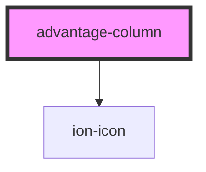

# tc-benefits-section

<!-- Auto Generated Below -->

## Properties

| Property         | Attribute         | Description | Type     | Default     |
| ---------------- | ----------------- | ----------- | -------- | ----------- |
| `advantageText`  | `advantage-text`  |             | `string` | `undefined` |
| `advantageTitle` | `advantage-title` |             | `string` | `undefined` |
| `iconColor`      | `icon-color`      |             | `string` | `undefined` |
| `iconName`       | `icon-name`       |             | `string` | `undefined` |

## Dependencies

### Depends on

- ion-icon

### Graph

----------------------------------------------

*Built with [StencilJS](https://stenciljs.com/)*
